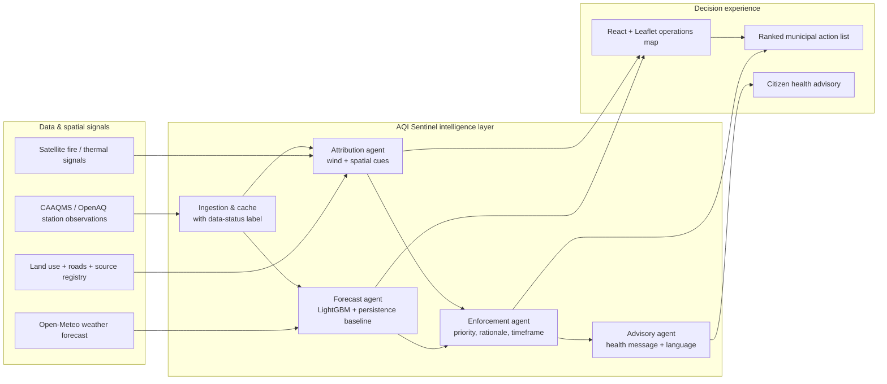

# Architecture Diagram

## Production safeguards

- Ingestion records whether a response is live, cached, or a demo fallback.
- Forecast metrics are reported only from a time-ordered holdout; a 24-hour persistence forecast is the baseline.
- Attribution is an inspection-prioritisation hypothesis, not proof of legal responsibility.
- Recommended enforcement actions require human review and field verification.
